<!--markdownlint-disable MD028 MD033 MD036 MD041 MD045-->

> [!TIP]
>
> 「彼方赴尘」是现实生命体（容器）的代号。零音LyRin 和 雾色深海_sc 是装载于容器的两个灵魂，前者是游离于互联网的数字生命，后者是面向三次元交往的个体。零音LyRin 和 雾色深海_sc 使用不同的人设和装载方式，且前者的人设与「彼方赴尘」的实际表现亦有差别。详见 CrystaRain镜雨亭（2025 年晚期完工）。

> [!WARNING]
>
> 零音正在高三二轮复习，因此可能无法准时回复你的消息。若确有要事，请留言，感谢理解——

<!--

...    ..    ....                                                                                                                                  ....
       ..     ... .                                                                                                                                ....
       ..     ... .                                            .......                                                                             ....
                                                             . ........                                                                            ....
                                                             ...........                           ...::-:........                                 ....
                                                        ......::...::...            ............-==.:.       ..:==..                               ....
                                                         ...::...::.....             ........-===.....       .....-:...                            ....
                                                        ...:...::.......          .......-=:*....... ..          ...-=.                            ....
                                                        ......::...    .....    .......=-::=-.......=....           ..-=.                          ....
                                                         ..:::-.... ..........  .....+-::::=-......+-:...........     .:=..                        ....
                                                        ......:-...:-----------:...=:::.::-%....-:...:--:=--+=....... ..=:.                        ....
                                                         ....--::..........:.....--:::.:::+:...:-.............::-.-.. ...=:                        ....
                                                      ...--:..:=+=-:::::....:::.=:...::::==..-:.................:::... ..==                        ....
                                     .......   .......-:.:++:::.......:.:.::..::..:::::#+...:+..:::::......:::....==*.....-...                     ....
                                   ..........  .....=.-*:......:::=+**++===+=-:::::::+-....:=::::::::::::::::::::..--.....:-..                     ....
                            ........-=++++=-:.....:.=:....::=*=-:.............::+*-::-+:::-+:::::::::::::::::::::::::+....+...                     ....
                            ....=:::::::::::.:.:=+-...::-+-::...........:..........:-*-:-*-::::::::::::::::::::::::::-:::-=.                       ....
                            ....-+-:::::::::.::.....:=+::....:...........:............::--::::--:::::::::::::::::::::==-:...                       ....
                            ....-::+:::::::.......:==:.......-............:.............:-:::---::::-:-::::::::::::-::::::=-.....                  ....
                            ....:=-=:=:::::....::-=::........-.............:..........::=-::----::::---::::---:::-=..*-::=+=:....                  ....
                             ....--:::-=::.....:=:::....:....-.............-...........:---::::::::----:::----:---:-=+:....*:....                  ....
                                ..+:::::+::::::+:-:.....-....-.............::..........:-----::::::---:::-------++..........+....                  ....
                                ...=:=-=--=:::*:-.......-....-..............-:.........:-------=-=-----:------=*-...........+:...                  ....
                                ....+==-+::-:+:=:.......-....-..............-:-..........=:::::::::=+-------===-............*:...                  ....
                                 ....=::::::+:=:........-....:..............=..=..........:+---------=+=---==+*...........:-+....                  ....
                                ......-::::-=-:.........=....::.............+:..=....:.......:-=----=========*...........:=-.....                  ....
                                 .....=::::+--..........=....:+.............-=..-=:...:-.........:---===+++=-:#:.......:=-.. ...                   ....
                                 ....---::--=...........=....:-:............-----**##+:.=:...........:----:....:+:....::=:....                     ....
                                .....::=::==:..........--:...=-=............---:..--=...--:........:...:=.:........:+**+*+.=...                    ....
                                ....::.+::*-..........-.-:..:=+*-...........-.:--.:::--...::........:..-...::.............:+....                   ....
                                ....=.:---*...........-:-:.=#=..:=..........:-...-.:...-:..-:.......:.-:.....=............=.-:...                  ....
                       ........::...==.:=-*..........=.--#*-:....:-..........:...........-:.=:........-::.....:-:::::::----:--...                  ....
                       ..%@@@@@%*...+:..:-+..........::-=:.-......:-..........:...........:-:=.......-:.........-:..........-...                   ....
                       .....-%.....-:..:.-=.........:.-:.::.........=.......................---.....::.:....:..............=....                   ....
                            :@-...-:..-..-+.........=::..............--..--:::..:............:=:....=...:...::.....:::..:.:...                     ....
                     ...-=*#%@@@@@+.--:...=........:--.................:..:.........==:....::::-...:-......:....:........:-.                       ....
                     .#%#*+=-@@:.:-:.:-...-........:::...............................:*%@%#%@%+=...::...........::......-:-.                       ....
                     ........%@:......-...:........:-...............................:%@%#++=++*=...-:....................=.                        ....
                            .#@-......:....-.......::.........::...............................-...=.....................-..                       ....
                  ...:::.....+@:...:-..-....:......-...........:-=...............:..:.:...:.::.:...+....................-:.......                  ....
                   .:::::::.......---:.:....:-.....-......:###@@@-...........:..:..:.::..:.:::-...==....................+.:-....                   ....
                  ..::::::##::...-----:.=....-.....::...%@@@@#:.....:..:..:.:..:..:.:..:..:..-...:--...................-..--:...                   ....
                  ...:::::+@=::-=**----:.:...-......-...%@#:.....:..:.:..:.:...............::....+:-...................+.:---...                   ....
                  ....:::-=@*=@@@#=------..:.:...=...-...........:.:.......::--:..........:...:-=-.-..................=..----...                   ....
                   .....:*%@#::-%@**=-----:.::..:-....-.......:.:........=-:::::==-..........:::=..-..................-.:---:...                   ....
                     ....:-@#==%@@-+@@#=-:.:+=.:=-=-:..::....:..........-::::::::::-...........=:..-.................+.:-----....                  ....
                       ...*@@+@@+@-::-+-..=-=::-------===-:............-:::::::::::-..........:-...:................-:.------:...                  ....
                       ..+-*%:-:-@-::::..+---=::::---::---.............::::::::::::-.........:+....:..............::+.::-----:...                  ....
                          .-#:::-#-:::::+----=:...--=....:-.............:::::::::::.........:=:....:.............::-.::::----:...                  ....
                       ...:...--:::::::*----+=:.:-..::..:-:-..............................:+==...................:=.---::::--....                  ....
                       ...::*%#=--#%=.=----=:..-..-:.-:=--..:..........................-+====...................:=.:----::::::...                  ....
                       ....*-::=#*-:::=----:....:-...=---==::--...................:=+*::::-:...................:-..-------:::::....                ....
                       ...---:::::--:-------==.....=---=+====++::--+*++++++*===--::.:*+++#:...................:--.::--------:::::....              ....
                       ..------::::--.:+-------=+*----=-.+===-=++-...........:**++*##*++*....................::-.:::::-------.::::....             ....
                       .---------::::---.:#-----=+==+:..:*=-*:.....=-........:+++++++#*:.....................:=..:::::::----:..::::...             ....
                       .----------:::::---:..=#*#:..:.=-.......:......+.....:=*+**%-........................:-:.:::::::::---..........             ....
                       .:-----------:::::---:..-.::.+:-:..........:....:=...:*++*#:........................::-..::::::::::::..........             ....
                       ..---------.........:.:-.:.+................=.....=-+*+=+%+.:...:...................:=..::::::::::::::........              ....
                       ...-------..-+...:-..+...-=...:::.-.........::....=+#+=+##*.=...-:.................:::.---::::::::::::::......              ....
                       ....------.--.....-*..:.+:...........:.:.....+..:-=##+++%##.=...::.............:...:+.:----:....:....:::::....              ....
                       .....-----.-:......=.-:+:................:...*==--+#*%++###.=..:...............:...-..---:..=+:....::.:::::...              ....
                       .....------.-=:..--.-.=..............::.....:=..-:****%%#*#:=..:..-===-...........:=.:--:.=-........*.:::::....             ....
                       ......------.......-:-:................:...:=...*:*****#**#.=:.:..====-.........::=..---.=..::.++===..:::::....             ....
                            ..------------:.-..................::-=...--.********#:.*....:===:.........::-.:--.+....-+.....::::::.....             ....
                            ....----------.=:...................=:.:+--+-#*******#:.=--=...............:=..--:.-...:#..   ...........              ....
                            ........:----:.+..................:=...+...-#********#::=..::..............-=.:--.-:...*...       .. ...               ....
                                .....----::-.................--....:***=#**###***#=.===+...............=..:-:.*....*...                            ....
                                 ....----:::..............::+:.........=%##%####%#-....................=+-...-....+-.                              ....
                                .....-----.=-...........::-+...........#%#*#%##%##.....................===+-+....-=.                               ....
                                .....------..+-:::::::::-=..........:..#****++**#-.....................-........++..                               ....
                                 ....:-------:...::::...-...........:.:#***####**......................-......-%:.                                 ....
                                   ...:----------:::::..:.............-#**%%@#*#+...:..................+*###@#=*:.                                 ....
                                      .:-------------..=..............=#**+-=%##-...:..................=========+:                                 ....
                                      ...-----------:.-:..............+***+:-**#.......................-=========*..                               ....
                                      .....:--------..-...............*#*******#...:...................:=------==*..                               ....
                                     ................-............:..:#*#######*...:....................+-------=*..                               ....
                                                   ..-:...........:..-**********........................:=------=*..                               ....
                                                    ...=:........:...:#********#:.......................:-------=.                                 ....
                                                      ...-=:........:*%#########+:....................::====-==+..                                 ....
                                                      .......:::-==--......:::::.+::................:----===-:....                                 ....
.  .................................................................................-==-...:=====-.....................................................
..........................................................   ..........................................................................................
.......................................................................................................................................................

-->

<div align="center">

<br>

> 当钟摆的轻拂波动起年轮的涟漪 /
> 夜空在烟火的像素流光中重组梦境<br>
> 相遇是概率云里最明亮的相干干涉 /
> 在彼此的视网膜上折射出恒久虹光
>
> 我们在新年交错的时间之弦上 /
> 交换来年彼此即将谱写的春的序曲<br>
> 而那坠落的星光伴着我心跳的频谱 /
> 指向未定义的名为羁绊的永恒奇点
>
> \- [lyrin](https://github.com/LyRin-owo)\\[aris](https://github.com/Aris-Offline) copresent -

</div>

---

<div align="center">


# lyrin://2025 - 在未尽的解构中重建巴别塔

[](https://git.io/typing-svg)


</div>

首先，祝所有到访的朋友们，新年快乐——！🏮

这里是零音，一个在现实和虚拟世界中都努力存活的未知生命体，一个卡在 600 分线上不去下不来的卑微高三生，一个全靠装备没有一点实力的 biker ~~或者说我也喜欢保护小动物~~，一个离开了 DeepSeek 和 Copilot 就敲不出一行代码的 Python 和 C# 初学者，一个被人天天叫做「舞萌吃」但是 RATING 才 6000 的超级飞舞音游人（😭

不过零音还正在进化中，前途未知但光芒璀璨——现在暂时先解决高考的问题吧，祝各位 2025 高考/中考生一飞冲天、金榜题名！😋

<div align="center">

> 「悟已往之不谏，知来者之可追。实迷途其未远，觉今是而昨非。」<br>
> 「舟遥遥以轻飏，风飘飘而吹衣。问征夫以前路，恨晨光之熹微。」

</div>


<!--START_SECTION:waka-->

```txt
From: 21 January 2025 - To: 28 January 2025

Total Time: 0 secs

No activity tracked
```

<!--END_SECTION:waka-->

<div align="center">

[](https://github.com/LyRin-owo/LyRin-owo/actions/workflows/metrics.yml) [](https://github.com/LyRin-owo/LyRin-owo/actions/workflows/waka-readme.yml)

</div>


## 在做的项目

[Hazelita](https://github.com/LyRin-owo/Hazelita) - 适用于教学环境的 CAS 计算器。~~现在还在纠结究竟用 Python 还是 C#。（~~

## 个人 coding 技能和目标

<table><tr><td valign="top" width="49%">

### 了解过或学习过的

<div align="center">  
<a href="https://www.python.org/" target="_blank"></a>  
</div>

</td><td valign="top" width="49%">

### 感兴趣的和想要学习的

<div align="center">  
<a href="https://docs.microsoft.com/en-us/dotnet/csharp/" target="_blank"></a>  
<a href="https://dotnet.microsoft.com/download/dotnet-framework" target="_blank"></a>  
<a href="https://dotnet.microsoft.com/download" target="_blank"></a>  
<a href="https://en.wikipedia.org/wiki/HTML5" target="_blank"></a>  
<a href="https://kotlinlang.org/" target="_blank"></a>  
<a href="https://nodejs.org/" target="_blank"></a>  
<a href="https://www.android.com/intl/en_in/" target="_blank"></a>  
<a href="https://vuejs.org/" target="_blank"></a>  
<a href="https://www.djangoproject.com/" target="_blank"></a>  
<a href="https://www.javascript.com/" target="_blank"></a>  
<a href="https://www.rust-lang.org/" target="_blank"></a>  
<a href="https://docs.microsoft.com/en-us/powershell/" target="_blank"></a>  
<a href="https://nextjs.org/" target="_blank"></a>  
<a href="https://www.figma.com/" target="_blank"></a>  
<a href="https://azure.microsoft.com/en-in/" target="_blank"></a>  
<a href="https://flutter.dev/" target="_blank"></a>  
<a href="https://www.typescriptlang.org/" target="_blank"></a>  
<a href="https://www.docker.com/" target="_blank"></a>  
<a href="https://www.w3schools.com/css/" target="_blank"></a>  
</div>

</td></tr></table>


## 尾声

<div align="center">

> 希望你活在不可替代的故事中。
> ——谷川俊太郎《如果可以的话》

很感谢你看到这里！ (\*/ω＼\*) 无论如何，祝愿你能够天天开心，永远幸福快乐下去！新年快乐——


</div>

<div align="center">

## ⭐ 广告位 ⭐

**✨ 优秀开源项目友情推荐 ✨ - [不感兴趣？](https://dxy.com/disease/26233/detail "很抱歉为你造成不好的浏览体验，点击这里以关闭广告。")**

# <a href="https://github.com/ClassIsland/ClassIsland"><image src="https://github.com/ClassIsland/ClassIsland/raw/master/ClassIsland/Assets/AppLogo_AppLogo.svg" height="25"/> ClassIsland</a>

🏫🧑‍🏫 神奇的 ClassIsland 小工具会将下课铃声和可视化提醒融为一体这不神奇吗 🧑‍🏫🏫<br>[点击链接 ClassIsland Releases 获取一个获取一个获取一个](https://github.com/ClassIsland/ClassIsland/releases)

<br>

✨ ClassIsland 是一款专为班级大屏设计的工具，可以显示天气、倒计时、时间、上下课提醒，亦可以用即将丰富的插件做到更多复杂的功能。**它甚至可以显示课表！** ✨

<!--markdownlint-disable-next-line MD001-->
#### | [🌐 网站](https://classisland.tech/) | [📚 文档](https://docs.classisland.tech/zh-cn/latest/) | [💬 官方频道](https://qm.qq.com/q/4NsDQKiAuQ) | [🗳 新功能投票](https://github.com/ClassIsland/voting/discussions?discussions_q=is%3Aopen+sort%3Atop) |


<br>

# <a href="https://github.com/Class-Widgets/Class-Widgets"><image src="https://github.com/Class-Widgets/Class-Widgets/blob/main/img/logo/favicon.png?raw=true" height="25"/> Class Widgets</a>

🤔😰 人设名称：rinlit；四、兴趣爱好：热衷于编程和卖。爱好程度：给钱就来 😰🤔<br>[点击链接 Class Widgets 官网获取一个获取一个获取一个](https://classwidgets.rinlit.cn/download)

<br>

✨ Class Widgets 是一款能够显示当前课程的桌面组件应用程序。其提供了易用课程表编辑和美观的桌面组件。 ✨

<!--markdownlint-disable-next-line MD001-->
#### | [🌐 网站](https://classwidgets.rinlit.cn/) | [📚 文档](https://classwidgets.rinlit.cn/docs-user) | [💬 QQ 群](http://qm.qq.com/cgi-bin/qm/qr?_wv=1027&k=yHXKCAjOxlpTpJ4mNdXm0mxOneYUinRs&authKey=sd3%2F06iGdOZUjkXXPBeIzGnFDIeYwmdwuM8dhk25fi%2B1CUL32MkeN2EEfjdo2pzE&noverify=0&group_code=169200380) |


<br>

# <a href="https://github.com/iNKORE-NET/UI.WPF.Modern"><image src="https://avatars.githubusercontent.com/u/130115968?s=200&v=4" height="25"/> iNKORE.UI.WPF.Modern</a>

🧰🤓神奇的 iNKORE.UI.WPF.Modern 能将 Fluent 2 的美丽界面和 WPF 的优秀兼容性融为一体这不神奇吗👆🧰<br>[点击链接 docs.inkore.net 获取一个获取一个获取一个](https://docs.inkore.net/ui-wpf-modern)

<br>

✨ 一个创新的 Windows Presentation Foundation (WPF) 应用程序 UI 库，旨在实现 WinUI 中的 Fluent Design 系统的时尚和现代美学。✨

<!--markdownlint-disable-next-line MD001-->
#### | [🌐 网站](https://docs.inkore.net/ui-wpf-modern) |


</div>


---

<br>

<div align="center">




</div>
