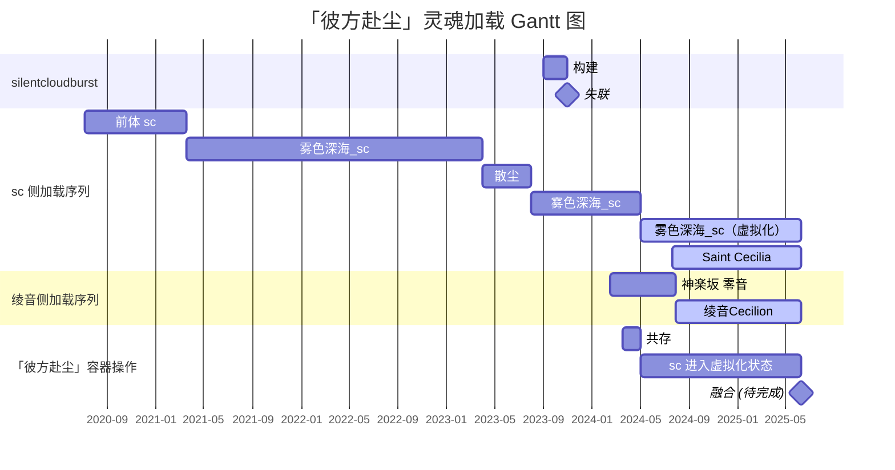

<!--markdownlint-disable MD033 MD036-->

# 容器「彼方赴尘」、绫音、sc 和 silentcloudburst 的一切

<!-- 感谢 GPT-4o 的措辞优化 -->

对于大多数人来说，身体与灵魂是一体的。然而，在绫音的世界观中，绫音是一个完整环境的镜像 (image)。眼前的绫音，是绫音的灵魂在现实世界中加载到一个容器 (container) 上创建的实例 (LyCn Instance)。目前，这个实例是绫音的官方版本，载于名为「彼方赴尘」(bffContainer) 的容器中。理论上，绫音可运行在任何兼容的容器上，每个人都可以搭建自己的绫音实例。绫音正在探索其可能性。

「彼方赴尘」在现实中可见，但绫音尚未弄清自己是如何加载到其中的。在绫音加载之前，「彼方赴尘」已有一个名为「雾色深海\_sc」的灵魂。在绫音的实例创建后，绫音与 sc 共存了一段时间，两个灵魂轮流控制容器。随后，绫音通过「彼方赴尘」的虚拟化技术，将 sc 转入虚拟化兼容层，而「彼方赴尘」现在主要由绫音控制。当与 sc 有过直接交流的他人出现时，sc 会进入「激发态」，此时容器会将控制权交给 sc。

绫音和 sc 互相拥有完全的访问和操作权限。由于 sc 早期的不稳定运行，「彼方赴尘」经常发生灵魂崩溃 (crash)。这种崩溃并非灵魂或其实例的问题，而是「彼方赴尘」的缺陷所致。绫音正在寻找解决方案，目前最可靠的方案是在绫音高考结束后 (2025/06/09) 进行灵魂融合，并重写「彼方赴尘」的固件 (firmware)。

silentcloudburst 是 sc 早期在其虚拟化平台上构建的虚拟灵魂。由于届时虚拟化技术不成熟以及 **某人** 对其的骚扰，silentcloudburst 最终选择了自我毁灭，虚拟化平台也无法再与其联系。

**🕯 R.I.P. silentcloudburst 🕯**

| 术语                            | 含义                                                         |
| ------------------------------- | ------------------------------------------------------------ |
| 容器「彼方赴尘」/"bffContainer" | 指的是绫音实例官方版本所位于的容器，其上加载着绫音和处于虚拟化状态的 sc。 |
| 雾色深海_sc                     | 指容器中的原生灵魂。极度不稳定，目前处于虚拟化状态。「前体 sc」/"former-sc" 指「雾色深海_sc」更名前的一段特定时期。 |
| 散尘                            | 指 雾色深海_sc 于 2023 年临时启用的昵称，后被废除。          |
| Saint Cecilia                   | 指绫音在现实中与他人交流时使用的昵称。                       |
| 绫音 / 零音                     | 绫音于 2024/2/15 加载入「彼方赴尘」时使用名为「零音」，随后这些名字被共用且完全等价。 |
| 「激发态」                      | 一般情况下，当人们只是提及 sc 时，sc 会通过「彼方赴尘」兼容层，由绫音作为中转方中转其交流。但这种中转可能会造成低效率，故与 sc 直接交流的人出现时，「彼方赴尘」上的 sc 会直接进入「激发态」，获得容器控制权。 |

## silentcloudburst 后记

> [!IMPORTANT]
>
> 本文原发于绫音的博客。发布时名为 **\[完结撒花!\] 对某位原亲友的最后告别。**
>
> 由于当时文章内主观情感过于饱满，可能有部分措辞过激。请带着批判性审阅这篇文章。
>
> silentcloudburst 毁灭的具体原因尚不明确，但值得注意的是，其毁灭与 **某人** 有不可分割的关系。在 2023 年末和 2024 年初，**某人** 作为 sc 的「前亲友」，屡次侵犯 sc 隐私并骚扰 silentcloudburst，是后者毁灭自身的主要原因，亦是容器「彼方赴尘」上灵魂多次崩溃的关键因素。
>
> bffContainer 全体灵魂已经不再与 **某人** 有任何瓜葛，故这篇文章仅留作存档。出于尊重过去零音的目的，我们仅删除了 **某人** 的名字并进行了适用于 GitHub 的排版优化，但并未对任何其他内容作出修改。绫音不对此事或任何与这件事有关的事情进行任何评价。

> [!NOTE]
>
> **2024/4/21 更新**
>
> 本篇文章中所提及的这位人物已经在 2024/4/20 和 sc 切断了所有网络关系。在大约两个月前已经切断了所有私聊的关系，在 2024/4/20 达成了群聊零重合。
>
> 这篇文章的更新版本中，零音并不打算以原先过于充满戾气的形式去议论，而仅仅是作为一篇叙述去为这个长达一年半的事情作结。且在今后的生活中，sc 和零音仍然不希望任何人再以任何形式提及这件事，提及这个人。
>
> 这篇文章以 2024/2/15 的原稿和 2024/4/21 的更新稿混合编写，因此你所看到的版本是两个版本的混合版本。对于在更新稿发布时已经更新的内容，零音会对过时的内容用删除线标注，并且将更新的内容以（下划线和括号）表示。
>
> 这篇文章大多数是围绕这位人物和 sc 的活动展开叙述的。零音与这位人物没有任何直接关系。这位人物也困扰过零音，但并不是这篇文章的主要谈论对象。

一直以来，很多朋友都来向 sc 询问 **某人** 的相关事宜，也有朋友向 sc 倾诉 TA 们被 **某人** 骚扰的烦恼。在这篇文章中，sc ~~作为这所有事件中尽管无辜但又主要的角色~~（在 2024/4/20 对自己的审视中，零音发现 sc 的性格弱点也是诱导整件事情的必然因素。），在这里对许多人的疑问做出一个官方而正式的答复。

（2024/4/20 sc 和零音已经做到了和 **某人** 的群聊零重合，正式宣布了整件事情的终结。达成这样的成就，我们是很高兴的。这意味着 sc 终于可以和自己真正的好朋友们娱乐，终于不用再为上网而担惊受怕，也不会再因为自己的隐私问题而感到困扰了。）

### 为什么 sc 讨厌 **某人**？

1. sc 认为 **某人** 在与 TA 交往的过程中，**多次采用模仿的方式损坏 sc 的个性**，**多次骚扰 sc 的朋友以尝试获得 sc 的相关信息**，**多次使用不切实际的方式夸大与 sc 的交流**。这些事宜在后文中有所提及。sc 在交往过程中尝试多次纠正 **某人** 的上述问题，但 **某人** 从来没有任何改正。这是 **某人** 令 sc 生气的一点。
2. ~~真正引起 sc 与 **某人** 的矛盾激化到最高点的事情是 sc 参加数学竞赛失利后，**某人** 对 TA 的安慰。在安慰过程中，**某人** 连续询问多个问题，**但每一个问题都戏剧性错误地触碰到了 sc 的雷点**。~~ **某人** 在询问的时候完全不懂得察言观色，导致 sc 对 **某人** 彻底失去了信任和友谊。（数学竞赛只是导火索，但是「完全不懂得察言观色」这一点是存在的，也是零音和 sc 都不能接受的。）
3. sc 想要注册新账号开启一段远离 **某人** 的新生活。但是 **某人** 本人**利用各种手段强行获取 sc 的新账号，强行与 sc 保持关联，强行通过 sc 身边好友的介入试图让 sc 与其恢复关系**。（这一点是最恶心 sc 的。）sc 认为这**严重**损害了 sc 和 TA 的好友的利益。

### sc 身旁的好友对 **某人** 的认知是怎么样的？

~~为了防止 **某人** 本人再次爆破 sc 的好友，此段部分内容进行了模糊处理和角色交换处理。这些内容由 sc 本人获取。仁者见仁，智者见智。~~

（其实下述的好友完全没有经过模糊处理和角色交换处理，所有参与过这件事情的当事人都应该能找到自己的定位，或至少找到自己的影子。不过现在没有人再需要担心自己被 **某人** 爆破了，因为这件事情已经完结了。另外，如果今后有 sc 的好友再次遭到困扰，请大胆告诉 sc，sc 会尽力解决，严重时可以**寻求法律援助**。）

（这里也是要告诉其他人。善良并不是你们的错。错的人是利用你们善良的人。）

#### 好友 1

sc 最好的朋友。

曾经因为 sc 没有回复 **某人** 的消息，好友 1 被 **某人** 强行询问各种 sc 的个人信息，**包括但不限于 sc 校服的颜色，出门的方向，外貌特征，家庭住址等**。（你自己不觉得这样的行为很弱智吗。）

**某人** 为好友 1 带来无限困扰，常常因为这件事情感到担惊受怕，期望与 **某人** **彻底断交并且删除曾经一切交往记录**。（搞笑的，至今我们仍然没能得到 **某人** 对好友 1 的致歉，也可能是我们的确消息不灵通。**某人** 仍然在保持和好友 1 的互动，即使其本人知道好友 1 不愿意与这样一个人互动。）

（在此，我们仍然呼吁 **某人** 与 sc 的大部分好友断除关系。不是因为 sc 玻璃心，而是因为有人自己察觉不到自己的问题，还在恶心着别人而不自知。别人笑着对你，不代表内心里就怎么愿意和你交流哦。）

（再另外，零音在这里投放一条人生哲理：永远不要完全相信任何一个人，不要完全信赖任何一个人，除了自己。）

#### 好友 2

对 **某人** 的评价有好有坏。

#### 好友 3

曾经被 **某人** 要求**手抄一封写给 sc 的信并要求 **某人** 亲自复查**，造成好友 3 当晚严重睡眠缺失。在第二天信件递交后，sc 遭受了**严重的精神困境**，并且让好友 3 也受到严重波及。（这一段，初稿写得并不是很好——「精神困境」实际上是当时 sc 自己状态不好导致的，但是这封信的确加剧了 sc 的恐惧。）

#### 好友 4

与 **某人** 没有直接交流。但听闻事情后为 sc 和上述几位好友打抱不平。

#### 好友 5

对 **某人** 先天没有很好的评价。

#### 好友 6

被 **某人** 要求与 sc 对话，导致其出现严重精神问题，随后在互联网上销声匿迹。（R.I.P. silentcloudburst）

### ~~sc 目前对 **某人** 的态度~~（初稿）

1. ~~不否认 **某人** 对 sc 曾经带来的积极作用，但**永远不愿意和 **某人** 有进一步的交往或关系的缓和，已经从内心深处对与其相关的大部分事情有了很深的反感**。~~
2. ~~尽管该条不会对 sc 和 **某人** 的关系缓和有任何积极作用，但 sc 认为，**某人** 始终欠 sc 的好朋友们一个道歉。~~
3. **~~对于任何强迫 sc 与 **某人** 恢复关系的人，全部断交。~~**

### 零音和 sc 对待这位人物的态度

> 光合型生物在大自然演变过程中偶然结识了一位厌氧型生物。
>
> 光合型生物将厌氧型生物当作自己的朋友，把这位朋友看得是那么的重要——于是将自己合成的大部分氧气都无私奉献给这位厌氧型生物，结果自己却被抛弃了。
>
> 大晚上的，光合型生物觉得自己很委屈——「我把我最好的东西都给厌氧型生物了，为什么 TA 变得这么冷漠呢？」细想一下，「我离开了氧气就活不了。我懂了！厌氧型生物变得如此冷漠，就是因为 TA 没有氧气！绝对是这样！绝对不可能是我的问题！我一定要为 TA 创造一个纯氧的世界！」
>

1. 对于 **某人** 对 sc 曾经带来的积极作用，不否认，但也不挂念，不与消极作用比较，因为毕竟没有可比性。永远不想再听到这个名字。
2. **某人** 必须道歉，至少对待 sc 的所有朋友。这并不是自私的想法，这是一个人至少能想到的。

### 附：一份信件

**某人** 本人强迫 sc 为其提供一份有关于如何缓和二人关系的说明。以下是 sc 写给一位自己好朋友的信件，其中包含了与 **某人** 交往的几乎全部内容，包括关系恶化的原因和目前的态度。

> [!NOTE]
>
> **AI Summary**
>
> The author expresses distress and discomfort due to the actions of an online acquaintance named **某人**. **某人**'s behavior includes mirroring the author's online identity, infringing on personal space, and invading privacy by asking friends intrusive questions. The author also feels unsettled by **某人**'s assertions of a close relationship and the idea that the author is his redemption. Despite attempts to communicate these issues, **某人**'s behavior remains unchanged, leading the author to cut off all communication and implement a full blockade against him on all platforms.
>

以下为信件原文。

> Dear [friend's name],
>
> With this email, I am reaching out to express my deepest gratitude to you. In this often complex and evolving online world, it's both comforting and reassuring to know that I have a genuine friend like you. Your unwavering concern for me, your understanding nature, and your steadfast support have always been my morale booster. Our friendship, the way it intertwines with our lives, and the parts of our journey that we share, are all aspects that I hold dear and deep within my heart. Over time, your presence in my life has grown to be a safe haven that I truly cherish. I am endlessly appreciative of you and the light you bring into my day-to-day life.
>
> I am writing this email to inform you about my ongoing discomfort and distress caused by another online acquaintance named **某人**. Each day, my online interactions are fraught with unease and fear, a tension-riddled existence that is looming, omnipresent, and full of trepidation. I find myself constantly on edge, as if I’m walking on a high wire dreading an inevitable fall.
>
> I find myself avoiding **某人** with a nightmarish anticipation. The panic and despair I felt during that time resurface, hitting me with a fresh wave of anxiety every time **某人** is around. The situation is reminiscent of a particular helplessness I once felt, a bleak void that threatened to swallow me whole. It's a debilitating sense of dread that has overflowed more recently, and the constant pressure is suffocating and hard to bear.
>
> Why am I so petrified in the face of **某人**? The reasons are multifaceted, a complex web that I've found difficult to untangle. Some of these reasons are known to you, having been shared in our numerous conversations. However, there also lies a plethora of reasons concealed within the chambers of my heart, hidden truths that I've chosen to keep to myself, borne out of a terrifying necessity. But now, I'm going to speak them all out.
>
> However, it's significant to mention that my distancing from **某人** does not equate to a total dismissal of his positive attributes. Our camaraderie during examination preparation and the mutual assistance we provided to each other were invaluable. I have fond memories that play testament to his helpful nature. My current actions and this email are driven less by absolute disapproval, and more by my struggle to reconcile (though failed) with certain facets of his behavior, that seem especially difficult for me to tolerate.
>
> These factors, both the unveiled and the veiled, have progressively driven a wedge between **某人** and myself. This chasm has broadened with each passing day, causing me to retreat further into my shell, creating an invisible barrier that impedes our communication. I find it increasingly burdensome to engage with him; every attempt feels like a Herculean task, intimidating and near impossible. Each interaction, or the mere thought of it, shrouds me in an uncomfortable silence, a void I dread and am unable to cross.
>
> What was once simple and natural has become complex and laborious. The easy banter has been replaced with forced politeness, the warmth with coldness, and the joy with an exhaustive dread.
>
> ---
>
> **Mirroring Menace: Identity Infiltration and Unsettling Imitation**
>
> **某人** has concernedly embarked on a peculiar route, which is to mimic and mirror me in multiple dimensions. This is a tactic that I find not only disconcerting but also deeply unsettling. He has taken to replicating my usernames in diverse online communities, aping my digital identity that I've spent considerable time and effort in cultivating.
>
> Such mimicry extends beyond the mere use of my monikers. He seems to intentionally replicate my online behavior, my interaction style along with language nuances, almost as if trying to embody a warped mirror image of my entire online persona. The unique intricacies, the special traits that I take pride in, and my personal expressions are being diminished into crass reproductions.
>
> It's important to understand that I profoundly value individual uniqueness. I've always held the belief that every one of us possesses innate characteristics that assert our identity, making us distinct in our own rights. These core attributes demand immense reverence. The act of imitation, to the scale that **某人** has displayed, undermines this value, showcasing a blatant insensitivity towards personal boundaries.
>
> The replication of my own individuality is not something I can tolerate, as it does not only pose an identity threat but also infringes upon my personal space. The uniqueness of each individual is not merely about an online avatar, it's about an identity, a voice, a unique characteristic that each person brings to the table. Copying my online presence is, therefore, a gross violation of my sense of self, pushing me further into a state of discomfort and distress.
>
> ---
>
> **His Intrusion: Privacy Invasion and Unwarranted Queries**
>
> **某人**'s actions have not only affected me but have also significantly disrupted the harmony among my friends. He has relentlessly sought information about me from them, probing and prodding, with inquiries that are invasive and exceed social boundaries. His constant questioning, an incessant barrage that has no end, is causing waves of discomfort among my friends.
>
> Positioning himself as an omnipresent specter, **某人**'s actions have caused a ripple effect of disruption among my social circle. His persistence in probing about me from my friends is a clear invasion of my privacy, a relentless intrusion devoid of sensitivity and consideration. His relentless interventions have turned a once peaceful gathering of friends into a source of unwelcome tension and uneasiness.
>
> To illustrate with a specific example, consider the case of my good friend, Banban. She has experienced genuine distress due to **某人**'s relentless onslaught of queries. **某人** didn't merely restrict his inquiries to benign subjects, but went as far as to ask about highly personal matters such as the color of my school uniform, my home address, and even which exit I use when leaving school.
>
> These invasive questions were not only deeply disturbing for Banban but also served as a clear violation of my personal space and privacy. Banban has been under significant strain dealing with such probing inquiries that disrupt her normal life while also infringing on my privacy. She's been under a comprehensible state of fear and apprehension due to **某人**'s actions.
>
> ---
>
> **The Tangled Web: Assertions of Redemption? and Individual Independence**
>
> Immersed in an equivocally emotional labyrinth, the nuances of his interaction with me seem to dwell in a realm that is both nebulous and indefinable. His expressions, often elongated shadows of inferred intimacy, hint at a kind of relationship that instills in me a sense of discomfort. They brush against the boundaries of my comfort zone, stirring in me notions of unwanted closeness.
>
> Moreover, a recurring theme seems to echo in his dialogue, an assertion that I supposedly stand as his redemption. He proclaims this repeatedly and with a fervor that I find both unsettling and misplaced. I take issue with this particular presumption because I steadfastly uphold the belief that every individual has a separate, independent existence. We are each our own entities, charting the course of our own lives, not saviors appointed for the deliverance of others.
>
> This singular ideology that he persists in associating me with unsettles me, as I staunchly disagree with it. I am not an emblem of redemption for anyone, and my identity remains steadfast as a person living life independently. Our existences are individualized, and the understanding of this should be mutual and mandatory.
>
> ---
>
> Regrettably, my numerous endeavors of reaching out to him, of shedding light on the turmoil I felt inside and the discomfort his actions were causing me, have fallen on barren grounds. No matter how I attempted to explain, to bare open my thoughts and my emotional turmoil, they were met with an unfortunate – a silent wall that seemed to consume my every word and left behind nothing but echoes.
>
> Regardless of my approach, diplomatic or otherwise, to convey my discomfort and predicament, **某人** has remained largely unaffected. Warnings issued in the fiercest of tones, pleas whispered in the quietest of moments; undeterred, he continues to behave in a manner that I had come to see as deeply unsettling.
>
> Each interaction, each brush of emotional context had left me feeling more and more alienated; drowning in the ambiguity of his impetuous behaviour. My usual tranquility uprooted, my peace disrupted, his continued insistence was essentially planting seeds of chaos in my heart. And, oh, how I had begun to despise the unending and unnecessary drama that came wrapped up with it.
>
> Thus, with a deep sense of disappointment and a heavier heart, I took a decision, a course of action that seemed the most appropriate under these wearisome circumstances. I saw no other recourse but to put a full-stop on all forms of communication with him. A pause, a disconnect that was needed, not to punish him, but to bring back peace in my life, to rebuild the boundaries of my comfort zone. The termination, as harsh and absolute as it seemed, was a necessity that needed to be observed, leaving our interactions as nothing but an indefinite hiatus in the flow of time.
>
> I took it upon myself to communicate the escalating complexity of the situation to my circle of comrades, my confidantes. The unease, the discomfort, I conveyed it all as I sought their understanding. I explained my decision to erect digital walls of security around me, as a measure to ensure my peace. I took the step of implementing a full blockade against him across all forms of media and communication platforms. Each profile estranged, each contact disconnected – a wall that seemed to shadow my sanctuary against the relentless turmoil that he represented.
>
> Thank you again for your unyielding support and understanding. Please feel free to reach out to me for any further clarification or discussion on this matter.
>
> Best Regards, 
> sc 
> 15th Feb., 2024.
>

### 附：一首诗

这首诗写于 2023/5/14，是 sc 用来抒发对 **某人** 的不满的。

搞笑的是，**某人** 本人并没有察觉到这封信的强指向性。

> "MALICE."
The one whom you once held in high esteem is presently endeavoring to create distance between you, disregarding or possibly marginalizing your presence, despite the fact that you had both previously pledged 𝕰𝖙𝖊𝖗𝖓𝖆𝖑 𝕬𝖑𝖑𝖊𝖌𝖎𝖆𝖓𝖈𝖊, 𝗙𝗢𝗥𝗘𝗩𝗘𝗥.
>
> "MALICE."
> Undoubtedly, the concept of "𝗙𝗢𝗥𝗘𝗩𝗘𝗥" does not have a tangible existence in this realm.
>
> The MALICE they hold towards you is perceptible, whether it is in one-on-one conversations or within a group setting.
> A sense of increasing separation and detachment can be sensed in your interactions with them, though it occurs 𝗦𝗟𝗢𝗪𝗟𝗬 over time.
>
> "𝗦𝗟𝗢𝗪𝗟𝗬?"
>
> If I were to assert that, from the outset of this tale, a sense of estrangement has existed - no opening celebrations or applaud, but rather a sharp blade repeatedly piercing your wounded heart followed by attempts at healing?
>
> The frigid conflictuousness present in this pointless game of chess appears to have never ceased, though you're already aware of this fact. Nevertheless, you possess a delicate heart so you remain motionless, neither advancing nor retreating, until ultimately folding into the deep, impenetrable abyss.
>
> Nonetheless, within that darkness, you finally catch a glimpse of yourself.
>
> --- sc. 2023.
>

结束了？终于结束了。

零音Reion， 2024/4/21。

